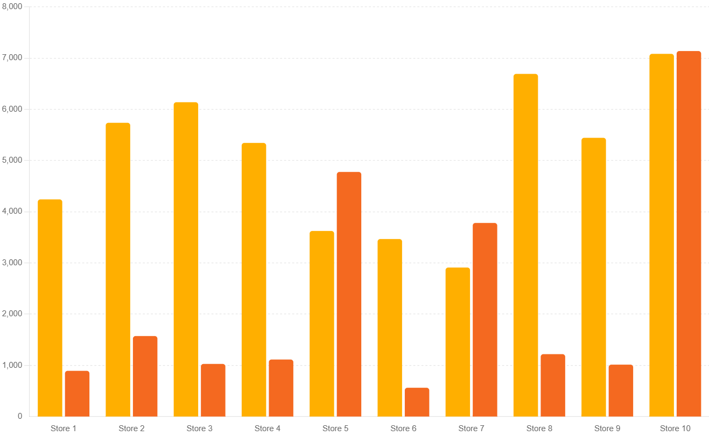

# Retail Sales Forecasting Using ARIMA and SARIMA Models

## Overview
This project forecasts retail sales for 10 stores using ARIMA and SARIMA models. Sales data, resampled to weekly and monthly frequencies, were analyzed to capture trends and seasonality.

## Key Findings
1. **Seasonality**: Monthly sales data exhibited clear seasonal patterns, effectively captured by SARIMA models.
2. **Model Performance**:
   - **ARIMA RMSE**: Ranged from 2909 to 7082.
   - **SARIMA RMSE**: Ranged from 562 to 7136.
   - SARIMA consistently outperformed ARIMA, except for Store 5.

## Business Insights
1. **Accurate Forecasting**: SARIMA models provide better forecasts, enhancing inventory management and reducing stockouts.
2. **Strategic Planning**: Improved demand predictions help optimize promotions, resource allocation, and operational efficiency.
3. **Store-Specific Insights**: Tailored strategies based on store-specific forecasts.

## Recommendation
Adopt SARIMA models for their superior accuracy in capturing seasonal trends, supporting better business decisions and strategic planning.

## Visual Insights
The bar chart comparing RMSE values highlights SARIMA's superior performance, making it the recommended model for retail sales forecasting.

